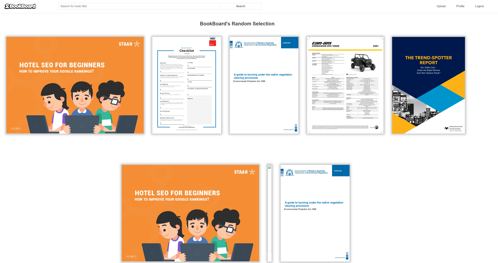
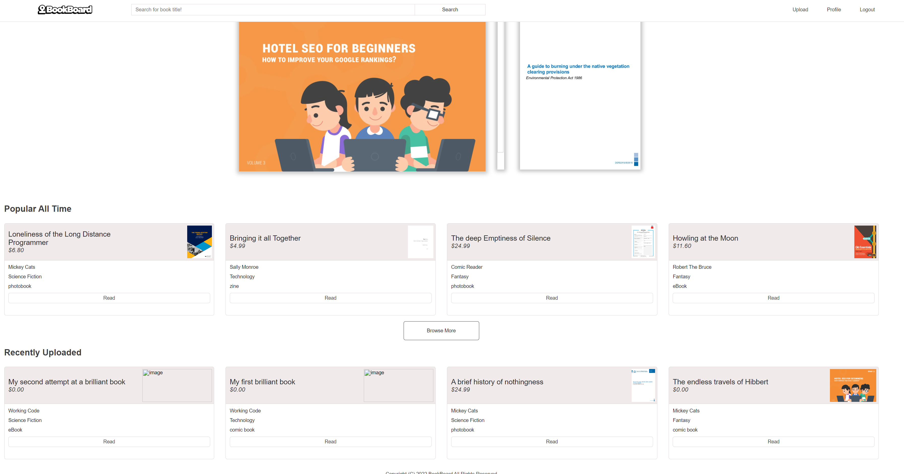
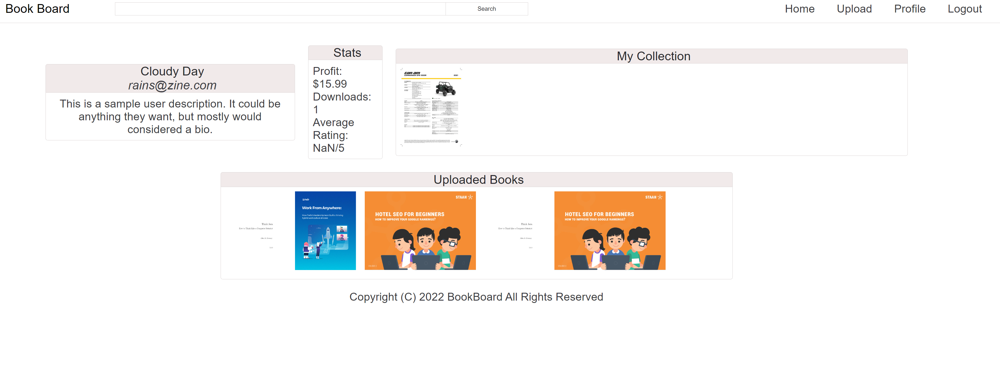
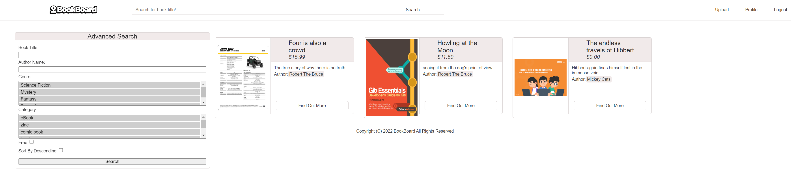

# BookBoard

 

## Description

A fabulous place for sharing (and selling) original content.  The responsive application allows creators of original works to upload their work (books, zines, comics, etc.) to a central marketplace, for reading by other users (consumers) of the application.  Users can view their profile, which will show books they've uploaded, and other pertinent information.  Consumers are able to search the marketplace by various criteria, in order to identify items of interest to them.  Consumers can then view the item, or download.  Consumers are able to leave reviews of the items they have read through which the creators can learn and improve their offerings.

 
  
## Table of Contents

- [Installation](#installation-notes)
- [Usage](#usage)
- [Features](#features)
- [Credits](#credits)
- [Contributing](#contributing)
- [Questions](#questions)

 

## Installation Notes  

  The application is deployed through Heroku, using Kitefin to provide the mysql database.   

 

## Usage 

  The application is intuitive for users.  Simply register and then log-in.  Once logged in, a User can upload works they have created or interact with items uploaded by other users.   

  The application is deployed at:  https://bookboardsite.herokuapp.com/  although there are issues with the deployment at this point in time.
 
   

  The Git repository for the applicaton is held at:  https://github.com/Cancer2806/BookBoard

 

  Following are screenshots showing the application in use:  

Launch Screen:
 
  
This screen presents a random selection of content for the user, followed further down by:
 
    
this part of the screen which shows popular content and recently uploaded content.   

 

Profile Screen:
 
  
This is where a logged in User can view their profile.  A similar screen is used to show a consumer key details about any author they are interested in.    

 

Search Screen:
 
  
This screenshot shows the advanced search page, through which consumers can track down any content that interests them.   

 
Preview Screen:
 
  
A user can click on a title that interests them and then be presented with a Preview of that work.   

 

## Features  

  The ability to upload original works, search the database based on specific criteria and download items of interest are considered key features of the Site.   
 

## Credits  

  Thinh Ho, Vinitha Gowtheepan and Frank Lavery shared in the creation of this applicaion.  

  Kitefin and Heroku were used for deploying the application to the Web, although this is not quite working for us at the moment.  Express, Sequelize, bCrypt, Handlebars, Multer, pdf-poppler are dependencies for the application.   

 

## Contributing  

  Please advise by email if there are contributions you'd like to make.      

 

## Questions
Please use email for any questions you may have.   

Github:  https://github.com/Cancer2806   
  https://github.com/th19776675  
  https://github.com/sreevinithaa  

Email:  frank.lavery@westnet.com.au
